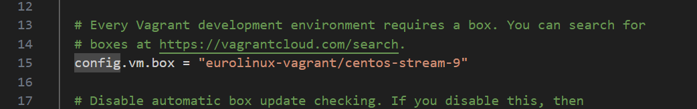
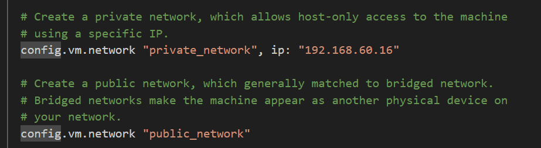
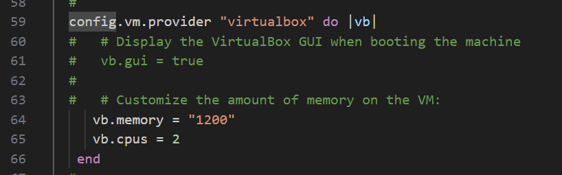

# Create-VM-manually-or-automatically-using-Vagrant-by-HashiCorp #
## simple way to create linux machines on your local for research ,tesing,development and other purposes ##

1. Download and install VirtualBox from the official  
  website: https://www.virtualbox.org/

2. Download and install Vagrant from the official website:  
  https://www.vagrantup.com/
 

3. Create a new directory on your local machine where you 
  want to store your Vagrant project
    (preferably a folder and sub-folder on your desktop).

4. Open your command-line interface (CLI) and navigate to 
  the directory you created.

5. Run the command 'vagrant init'. 
    This will initialize a new Vagrantfile in your directory.

6. Open the Vagrantfile in a text editor(I'm using VScode).

    Customize the configuration according to your requirements. 
    
    For example, I used an eurolinux-centos base box. Vagrant boxes can be found [here](https://app.vagrantup.com/boxes/search):

    

    Create a private and public bridged network to allow access to the machine by simple removing the "#" infront of configurations in the image.

    

    Customize the memory and cpu size using this example 

    

7. Run the command "vagrant up". 

    This will start the VM based on the configuration in your Vagrantfile.

    Vagrant will download the base box (if not already downloaded) and provision the VM according to your specifications.

8. Once the VM is running, you can access it via SSH        
    using the command "vagrant ssh".
    You can also access the VM directly through the Oracle  VirtualBox interface if needed.

9. You can manage the VM using Vagrant commands such as     
    "vagrant halt" to stop the VM, 
    "vagrant suspend" to suspend it,
    and "vagrant destroy" to delete it.

    Use "vagrant reload" to apply any changes made to the Vagrantfile.